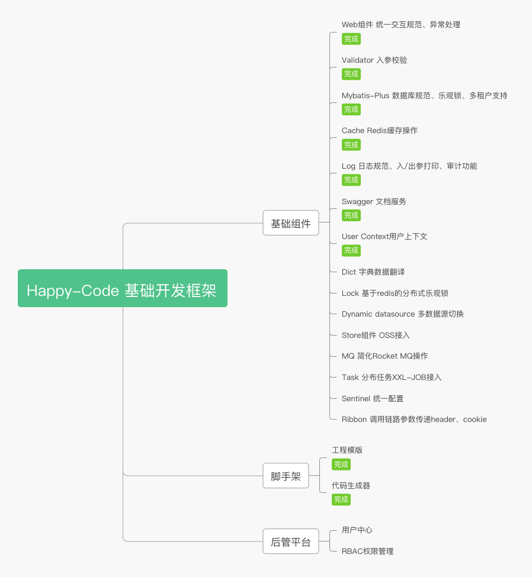

# happy-code
[](https://www.apache.org/licenses/LICENSE-2.0.html)

本项目将日常开发中一些优秀实践封装起来，以微服务技术组件的形式赋能开发，致力于让代码变得简洁优雅，让开发变得简单高效，实现按时下班，回家吃饭的小目标！

## 如何使用
### 如何引入依赖
在pom.xml的配置中添加父级依赖
```
    <parent>
        <groupId>cool.happycoding</groupId>
        <artifactId>happy-code-parent</artifactId>
        <version>1.0.2.RELEASE</version>
    </parent>
```
然后在 `dependencies` 中添加自己所需使用的依赖即可使用
注意: 引入该parent之后，在添加happy-code,spring-boot,spring cloud,spring alibaba cloud 组件时均不需要再指定版本号

### 文档
- [Happy Code文档](http://www.happycoding.cool)
- [Happy Code配套脚手架工具](http://www.happycoding.cool/bootstrap/)

## 规划


## 模块介绍
- happy-code-base
- happy-code-dependencies
- happy-code-parent
- happy-code-starters
    - happy-code-starter-log
    - happy-code-starter-mybatis
    - happy-code-starter-user
    - happy-code-starter-swagger
    - happy-code-starter-validator
    - happy-code-starter-web
    - happy-code-starter-cache
    - happy-code-starter-lock
    - happy-code-starter-dynamic-datasource
    - happy-code-starter-sentinel
    - happy-code-starter-mq

## 版本更新记录
### 1.0.4-SNAPSHOT[current]
-  refactor: 重构user组件的filter逻辑，去除糟糕的接口设计

### 1.0.3.RELEASE
- feat: 升级SC和SCA版本
- feat: 重构log组件补充feign调用场景下traceId的传递以及审计功能
- feat: 重构log组件将审计记录功能通过事件进行异步处理以提高效率
- feat: 增加分布式锁组件
- feat: 增加多数据源组件
- feat: 引入Sentinel逐渐并对BlockException进行了统一配置处理
- refactor: 重构新增UserDetailService接口定义，并逐渐废弃UserContextService接口的使用
- fix: 修校验组件性别校验的bug
- fix: 修复user组件requestWrapper类出现的集合操作异常
- fix：修复从error控制器中复抛异常时request path获取不准确的问题

#### 依赖版本升级
- Spring Cloud 2020.0.2
- Spring Cloud Alibaba 2020.0.RC1
- Spring boot 2.4.3

### 1.0.2.RELEASE
- feat: 在banner打印中添加happy-code的版本号
- fix: 修复打印Exception 出现errMessage丢失的问题
- fix: 修复出现404时的处理逻辑(404报500的问题)

### 1.0.1.RELEASE
- feat: 引入jetcache完善cache组件
- feat: 完善mybatis组件引入乐观锁定义支持
- feat: 引入阿里ThreadLocal组件
- feat: 定义默认线程池(happyThreadPoolExecutor)，解决线程切换时上下文传递问题
- feat: web组件提供自定fastjson 序列化/反序列化配置扩展FastJsonConfigCustomizer
- feat: 完善log组件的功能提供mdc，请求耗时，请求参数/响应结果打印功能
- refactor: 更改组件依赖的继承体系，该改动会造成依赖不兼容的问题，按照新的配置方式进行调整即可
- refactor: 参照cola架构对异常和返回值封装进行优化
- fix: 修复cache组件组合注解的bug

### 1.0.0.RELEASE 
- feat: 初始版本
- feat: 规范依赖体系和版本
- feat: 封装web组件规定序列化/反序列化方式，封装前后端交互规范、全局异常处理规范
- feat: 封装validator组件，用于请求的入参校验
- feat: 封装swagger组件，用于接口文档的管理
- feat: 封装user组件，提供一个用于封装用户信息的UserContext
- feat: 封装mybatis组件，引入mybatis-plus，实现Entity对象规范定义
- feat: 封装log组件，规范log配置

## 框架选型
- spring Cloud Hoxton.SR8
- spring Cloud Alibaba 2.2.3.RELEASE

## 主要依赖
- lombok 1.18.12
- hutool 5.3.9
- fastjson 1.2.73
- guava 28.0-jre
- knife4j 3.0.2
- jetcache 2.6.0
- fastjson 1.2.75
- transmittable-thread-local 2.9.0

## 参考
- [Spring-Cloud-Alibaba版本说明](https://github.com/alibaba/spring-cloud-alibaba/wiki/%E7%89%88%E6%9C%AC%E8%AF%B4%E6%98%8E)
- [transmittable-thread-local](https://github.com/alibaba/transmittable-thread-local)
- [knife4j](https://gitee.com/xiaoym/knife4j)
- [hutool](https://hutool.cn/)
- [mybatis](https://mybatis.org/mybatis-3/zh/index.html)
- [mybatis-plus](https://baomidou.com/guide/#%E7%89%B9%E6%80%A7)
- [jetcache](https://github.com/alibaba/jetcache/wiki/Home_CN)
- [COLA](https://github.com/alibaba/COLA)